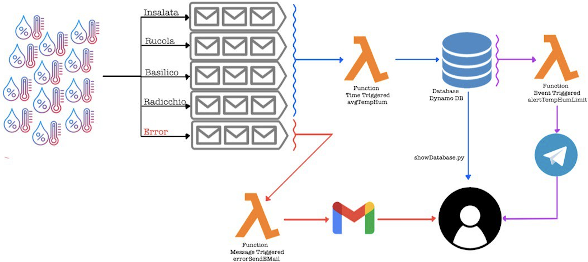
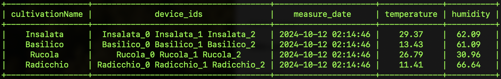
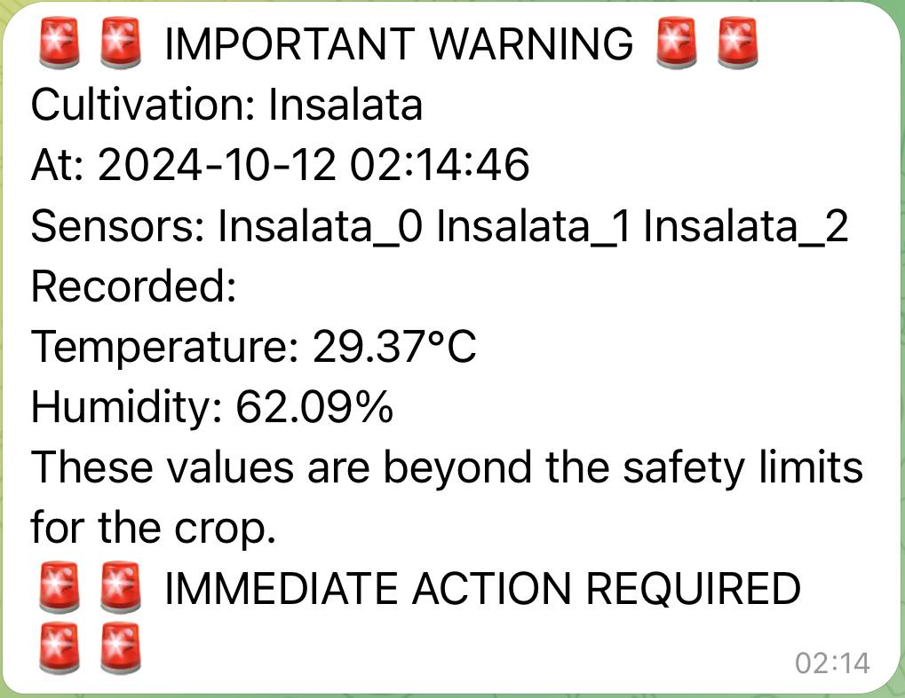

# Cultivation Control Program (CCP)

## Overview

The **Cultivation Control Program (CCP)** is a smart agricultural monitoring system designed to collect and analyze environmental data (temperature, humidity) from multiple IoT devices in different fields. It leverages AWS services like Lambda, DynamoDB, SQS, and SNS for a serverless architecture, enabling real-time notifications via EMail and Telegram.

This project was developed for the **Serverless Computing** exam at the **University of Salerno**, 2023/2024 academic year.

## Features

- **Environmental Monitoring**: Collects data from sensors to monitor Temperature and Humidity levels. These sensors can be emulated but also can be real.
- **Alerts**: Sends Alerts when values go beyond specified thresholds via Telegram, so an Employee can do something.
- **Alarm**: Send an Alarm EMail to a given Address (and from another given Address) when a sensor send an error Message. 
- **Data Storage**: Stores real-time sensor data in a DynamoDB table.
- **Event-Driven Architecture**: Uses AWS Lambda and SQS to process and analyze data.
  
## What do you need to run this Project

- **Python** (mine is the 3.10 so i can suggest this version);
- **Docker** (where we are gonna create a Container with LocalStack);
- **Arduino** and **Arduino IDE**(If you want to use a real Sensors);
- **AWS CLI** (So we can control what is happening in the Container);
- **boto3** (Python Library for interact with the System);

## Architecture

We are in a field with four different greenhouse cultivations, each requiring specific humidity and temperature conditions. Three sensors are installed in each greenhouse to measure temperature and humidity every minute. These sensors communicate with an MQTT Broker, publishing to topics named **`"CultivationName_Temperature"`** and **`"CultivationName_Humidity"`**, sending messages with their ID and the recorded measurement. If an error occurs, the sensors send **`"ERR"`** in place of the value.

An application listens to these MQTT topics and inserts the collected data into specific SQS queues, formatting each entry as **`Device ID, Temperature, Humidity, Measure Date`**.

Here, the first Lambda function, **`avgTempHum`**, is triggered every 5 minutes. It calculates the average temperature and humidity for each cultivation based on the values in the queue, then stores the results in a DynamoDB database. We can view the contents of the database table using the Python program `showDatabase.py`. However, no other graphical interfaces are currently implemented.

Another Lambda function, **`errorSendEMail`**, monitors the **`Error`** queue and, upon receiving data, sends an email alert. This function retrieves Gmail account credentials and recipient addresses from a **`secrets.json`** file.

Lastly, the **`alertTempHumLimit`** Lambda function is triggered whenever the database is updated. It checks whether the new average temperature and humidity values exceed predefined thresholds. If they do, an urgent notification is sent via Telegram using a bot. The bot token and chat ID are specified in **`secrets.json`**.

In this project, we can also emulate sensor behavior or directly load test data into the database to better test the Lambda functions, all through the scripts available in the **`utility`** folder of the project.

## Getting Started

### Required Packages and Installation

To run the project, you need to install the following packages: `zip`, `python`, `boto3`, `docker`, `awscli`, `tabulate`, and `jq`.

#### Installing on Debian (with `apt`):
'`
sudo apt update
sudo apt install zip python3 python3-pip docker* awscli jq -y
pip3 install boto3 tabulate (se usi pip)
apt install python3-boto3 python3-tabulate (se usi aptitude)
'`

#### Installing on macOS (with `brew`):
'`
brew update
brew install zip python3 docker awscli jq
pip3 install boto3 tabulate
'`

Ensure Docker is running after installation, and check the versions using:
'`
python3 --version
docker --version
'`

### Clone the repository and configure AWS CLI

Clone the repository with:

`git clone https://github.com/AntonioKill98/CultivationControlProgram.git`

Then configure the AWS CLI by running the following command:

`aws configure`

When prompted, provide the following values:

- AWS Access Key ID: `test`
- AWS Secret Access Key: `test`
- Default region name: `us-east-2`
- Default output format: `json`

This will set up the CLI for LocalStack, which simulates AWS services for your project.

### Easy Version (Recommended for Beginners)

1. Insert the necessary credentials into **`secrets.json`** to enable the **`errorSendEMail`** and **`alertTempHumLimit`** Lambda functions.

2. Start the LocalStack Docker container by running:
   `./utility/startLocalStack.sh`
   in one terminal.

3. In a new terminal, run:
   `./runAllServices.sh`
   This will activate, configure, and test all project components.

### Intermediate Version

1. Start the LocalStack Docker container with the command:
   `./utility/startLocalStack.sh`
   This command runs the following Docker command:
   `docker run --rm -it -p 4566:4566 -p 4571:4571 -v /var/run/docker.sock:/var/run/docker.sock localstack/localstack`

2. Create the DynamoDB table by running:
   `python3 settings/createTable.py`
   This script uses Boto3 to create a table with DynamoDB streams enabled, which will be used later.

3. Load initial data into the database by running:
   `python3 settings/loadData.py`
   This populates the database with random data entries.

4. Create the necessary SQS queues by running:
   `./utility/createQueques.sh`
   This script runs:
   `aws sqs create-queue --queue-name nameOfQueue --endpoint-url=http://localhost:4566`
   for each queue required.

5. Create the Lambda Role and assign a policy by running:
   `./utility/createLambdaRole.sh`
   This script creates a role using:
   `aws iam create-role ...`
   and assigns a policy using:
   `aws iam put-role-policy ...`

6. Create the first Lambda function, **avgTempHum**, by running:
   `./utility/createLambda_avgTempHum.sh`
   This script creates a ZIP file containing the **settings/avgTempHum.py** script and registers the Lambda function using:
   `aws lambda create-function ...`
   while associating the Lambda Role created earlier.

7. Test the first Lambda function manually:
   - Fill the queues with sensor data by running:
     `python3 utility/IoTDev_Emulation.py`
   - Check the queue contents with:
     `./utility/printQueue.sh nameOfQueue`
   - View the database contents before invocation:
     `python3 utility/showDatabase.py`
   - Manually invoke the Lambda function:
     `./utility/invokeLambda_avgTempHum.sh`
   - View the database again after invocation:
     `python3 utility/showDatabase.py`
   - Finally, set up a scheduled event to trigger the Lambda function every 15 minutes using:
     `./utility/createEvent_avgCalculation.sh`
     This creates a CloudWatch rule using:
     `aws events put-role ...`
     and associates the event with the Lambda function using:
     `aws lambda add-permission ...`

8. Initialize the second Lambda function, **errorSendEMail**, by running:
   `./utility/createLambda_errorSendEMail.sh`
   This script creates a ZIP file containing **settings/errorSendEMail.py** and **secrets.json**, creates the Lambda function with the previously created Lambda Role, and sets up event source mapping for the **Error** queue. 
   Test it using:
   `./utility/test_errorSendEMail.sh`
   which publishes a message to the **Error** queue simulating a sensor failure.

9. Lastly, initialize the **alertTempHumLimit** Lambda function using:
   `./utility/createLambda_alertTempHumLimit.sh`
   This script creates the necessary ZIP file containing **settings/alertTempHumLimit.py**, adds **secrets.json**, and includes the **requests** library (required for the Telegram bot) from **settings/alertTempHumLimit_package**. After creating the Lambda function, the script sets up event source mapping between DynamoDB updates (enabled by the stream) and the Lambda function. 
   Test this by running:
   `python3 ./utility/test_alertTempHumLimit.py`
   which inserts faulty data into the **Insalata** cultivation record to trigger the Lambda function.

### Usage of a Real Arduino

I have created an Arduino script specifically for the **Arduino UNO WiFi Rev4** (important note: older Arduino UNO WiFi boards used the WiFiNINA library, but this is no longer used). The script includes a `secrets.h` file where you can input your WiFi network name, password, and the address of your MQTT broker. The temperature sensor used is a **DHT22**, connected to pin 2 of the Arduino.

Currently, both the Arduino and the Python communication script are programmed solely for the **Rucola** field. The Python script simulates having three sensors (**Rucola_0**, **Rucola_1**, and **Rucola_2**) by triplicating the received information.

To use this system:
1. Start the MQTT broker in a new terminal with:
   `./utility/mosquittoStart.sh`
   
2. In another terminal, run the communication manager Python program:
   `python3 utility/listenToRucola.py`

## Future Updates

- Improve the communication between Arduino and the system by generalizing both the Arduino sketch and the communication manager, making it suitable for all sensors or even eliminating the need for the communication manager altogether.
- Add more comments to the code and create helpful prompts when commands requiring arguments are invoked without them.
- Add useful parameters inside the greenhouse, such as a tank fill sensor, an additional soil moisture sensor, and implement a method to control sprinklers.
- Add a graphical user interface (GUI) to better visualize data, which will be essential as more parameters are introduced for management.